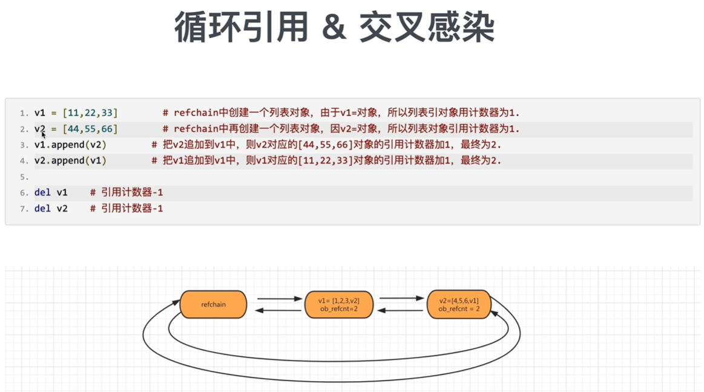

# 引用计数器为主，标记清除和分代回收为辅+缓存机制
## 引用计数器
### 环状双向链表 refchain

在python程序中创建的任何对象都会放在refchain链表中
```python
# 内部会创建一些数据[上一个对象、下一个对象、类型、引用个数]
name = "武沛齐"
new = name  # 会引用name，引用个数+1
# 内部会创建一些数据[上一个对象、下一个对象、类型、引用个数、val=18]
age = 18
# 内部会创建一些数据[上一个对象、下一个对象、类型、引用个数、items=元素、元素个数]
hobby = ["篮球", "美女"]
```


在C源码中如何体现每个对象中都有的相同的值：PyObject结构体（封装4个值）
有多个元素组成的对象：PyObject结构体（封装4个值）+ ob_size
### 类型封装的结构体

```python
data = 3.14
# 内部会创建：
#   _ob_next = refchain中的上一个对象
#   _ob_prev = refchain中的下一个对象
#   ob_refcnt = 1
#   ob_type = float
#   ob_fval = 3.14
```
### 引用计数器
```python
v1 = 3.14
v2 = 999
v3 = (1, 2, 3)
```
当python程序运行时，会根据数据类型的不同找到其对应的结构体，根据结构体中的字段来进行创建相关的数据，然后将对象添加到refchain双向链表中
在C源码中有两个关键的结构体：PyObject、PyVarObject
每个对象中都有ob_refcnt，这个就是引用计数器，值默认为1，当有其它变量引用对象时，引用计数器就会发生变化
* 引用
```python
a = 999  # ob_refcnt = 1
b = a  # ob_refcnt = 2
```
* 删除引用
```python
a = 999
b = a
del b  # b变量删除; b对应的对象引用计数器-1 -> ob_refcnt = 1
del a  # a变量删除; a对应的对象引用计数器-1 -> ob_refcnt = 0
# 当一个对象的引用计数器为0时，意味着没有人再使用这个对象了，这个对象就是垃圾，将会进行垃圾回收
# 回收
    # 1.对象从refchain链表中移除
    # 2.将对象销毁，内存归还给系统
```

### 循环引用问题

## 标记清除
> 目的：为了解决引用计数器循环引用的不足
> 实现：在python的底层再维护一个链表，链表中专门放那些可能存在循环引用的对象（list/tuple/dict/set）


在python内部`某种情况`下触发，会去扫描`可能存在循环引用的链表`中的每个元素，检查是否有循环引用，如果有则让双方的引用计数器-1；如果是0则垃圾回收
* 什么时候扫描？
* 可能存在循环引用的链表扫描代价大，每次扫描耗时久
## 分代回收
> 解决标记清除的两个问题


将可能存在循环引用的对象维护成3个链表
* 0代：0代中对象个数达到700个扫描一次
* 1代：0代扫描10次，则1代扫描一次
* 2代：1代扫描10次，则2代扫描一次
```
循环引用对象会被加到refchain和0代链表中，当0代链表中的引用对象达到700的时候，会对0代中的所有元素做一次扫描
如果是垃圾，od_refcnt减1，等待垃圾回收；如果不是垃圾，会升级到1代链表中，并标记0代已扫描一次
0代扫描十次，才会扫描一次1代
同样的，1代中是垃圾的就回收，不是的就升级到2代，并标记1代已扫描一次，达到十次后开始扫描2代
```
## 小结
在python中维护了一个refchain的双向环状链表，这个链表中存储程序创建的所有对象，而且每种类型的对象都有一个ob_refcnt的引用计数器。
ob_refcnt默认值都是1，被引用就加1，删除就减1，最后当引用计数器变为0时会进行垃圾回收（对象销毁、内存归还、refchain中移除）。
但是，在python中对于那些可以有多个元素组成的对象可能会存在循环引用的问题，为了解决这个问题python又引入了标记清除和分代回收。
在其内部维护了4个链表，分别是refchain、0代（700个）、1代（10次）、2代（10次）。
在源码内部，当达到各自的阈值时，就会触发扫描链表进行标记清除的动作（有循环引用则各自减1）。
这样既解决了什么时候扫描的问题，又解决了全部扫描耗时久和代价大的问题。
But,源码内部在上述的流程中提出了优化机制（缓存）
## 缓存机制
### 池（int、字符串）
> 为了避免重复创建和销毁一些常见对象，维护池
```python
# 启动解释器时，python内部帮我们创建：-5,-4,...257
v1 = 7  # 内部不会开辟内存，直接去池中获取
v2 = 9
v3 = 666 # 会重新创建对象
```
### free_list（float/list/tuple/dict）
> 当一个对象的引用计数器为0时，按理说应该回收，内部不会直接回收，而是将对象添加到free_list链表中当缓存。
> 以后再去创建对象时，不再重新开辟内存，而是直接使用free_list
```python
v1 = 3.14  # 开辟内存，内部存储结构体中定义那几个值，并存到refchain中
del v1  # refchain中移除，将对象添加到free_list中（80），满了之后才会销毁
v2 = 999.9  # 不会重新开辟内存，去free_list中获取原来的对象，对象内部数据初始化，再放到refchain中
```
[pythonav](https://pythonav.com/wiki/detail/6/88/)
## Python的C源码（3.8.2版本）
